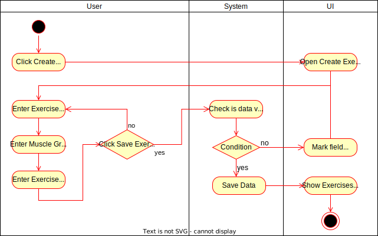

# 1 Use-Case Name

Create Workout

## 1.1 Brief Description

The user should be able to create their own exercises.
The user has to enter all the information about the exercise. For details see 2.1 Basic Flow.

- Enter a name, muscle group and description for the exercise

# 2 Flow of Events

## 2.1 Basic Flow

- User clicks on Create new Exercise
- User enters Name
- User enters Muscle Group
- User enters Exercise Description
- User clicks safe button

### 2.1.1 Activity Diagram

### 2.1.2 Mock-up


### 2.1.3 Narrative

```gherkin
Feature: new exercise

  As a signed in user
  i want to create a new exercise

  Background:
    Given I am signed in with username "USER" and password "PASSWORD"
    And I am on the "Exercises" page 

  Scenario: enter valid data and save the exercise
    When I press the "Create new exercise" button
    And I enter "Crunches" in the field "Name"
    And I enter "Abs" in the field "Muscle group"
    And I enter "Lay on the ground, put your hands behind your head and try to get your elbows to your abdomen while rolling yourself in" in the field "Description"
    And I press the "Save" button
    Then I am on the "Exercises" page
    And I receive a "Created exercise succesfully" message

  Scenario: enter invalid data and save the exercise
    When I press the "Create new exercise" button
    And I enter "Crunches" in the field "Name"
    And I enter "" in the field "Muscle group"
    And I enter "Lay on the ground, put your hands behind your head and try to get your elbows to your abdomen while rolling yourself in" in the field "Description"
    And I press the "Save" button
    Then I am on the "Create Exercise" View
    And the false field is highlighted in red
```

## 2.2 Alternative Flows

(n/a)

# 3 Special Requirements

(n/a)

# 4 Preconditions

The user has to be logged in to the system.
The user has to have navigated to the Training site

# 5 Postconditions

(n/a)

# 6 Extension Points

(n/a)
